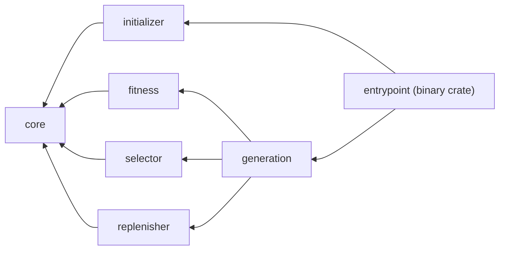
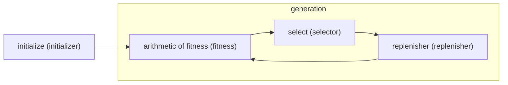
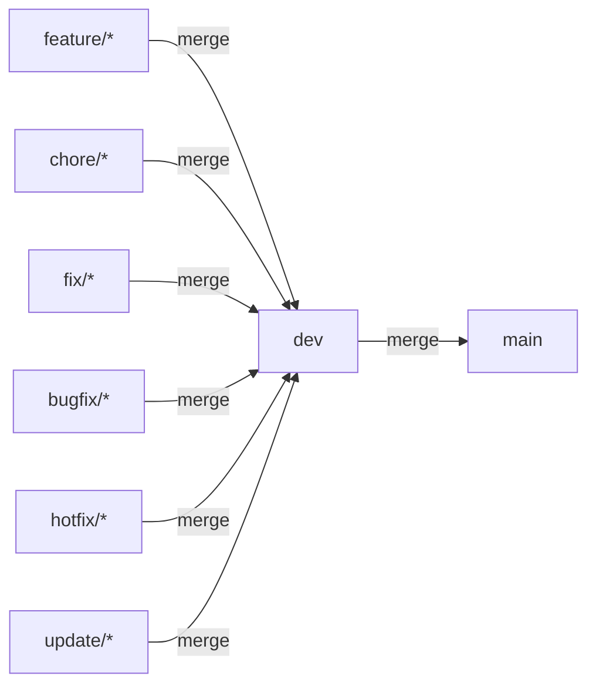

# Scarlet Queen

Scarlet Queen is a Rust framework for co-evolution.

## What mean Scarlet Queen?

The name is inspired by Red Queen's Hypothesis and Pokémon Scarlet and Violet.

Red Queen's Hypothesis is a hypothesis about co-evolution.

## Project Dependencies



## Life Cycle



## Project Structure

### `core` (library crate)

Contains the core type definition and logic.

### `initializer` (library crate)

Contains the logic for initializing the group (environment).

- modules
  - `random`: enables the random initialization.
  - `weight`: enables the weighted initialization.

### `fitness` (library crate)

Contains the fitness evaluation logic.

### `selector` (library crate)

Contains the logic for selecting individuals for the next generation.

- modules
  - `ramdom`: enables the random selection.
  - `roulette`: enables the roulette selection.
  - `tournament`: enables the tournament selection.

### `replenisher` (library crate)

Contains the logic for replenishing new individuals.

- modules
  - `random`: enables the random generation.
  - `novelty`: enables the novelty search algorithm.

### `generation` (library crate)

Contains the logic for managing the generation process.

### `entrypoint` (binary crate)

The binary crate that runs the Scarlet Queen framework.

## Get Started

```sh
cargo run --bin entrypoint
```

## Tests

- run all tests

```sh
cargo test
```
- run tests for a specific package

```sh
cargo test -p <test_name>
```

## Branch Strategy

### main

main branch is the release branch.

### dev

dev branch is the development root branch.


### feature

- feat/#[issue-number]-[issue-summary]

  example) feat/#12-add-card-button-component

### chore

- chore/#[issue-number]-[issue-summary]

  example) chore/#12-add-prettier-config

### fix

- fix/#[issue-number]-[issue-summary]

  example) fix/#12-change-title

### bugfix

- bugfix/#[issue-number]-[issue-summary]

  example) bugfix/#12-fix-button-color

### hotfix

- hotfix/#[issue-number]-[issue-summary]

  example) hotfix/#12-fix-critical-bug

### bugfix

- bugfix/#[issue-number]-[issue-summary]

  example) bugfix/#12-fix-button-color

### update

- update/#[issue-number]-[issue-summary]

  example) update/#12-update-dependencies


