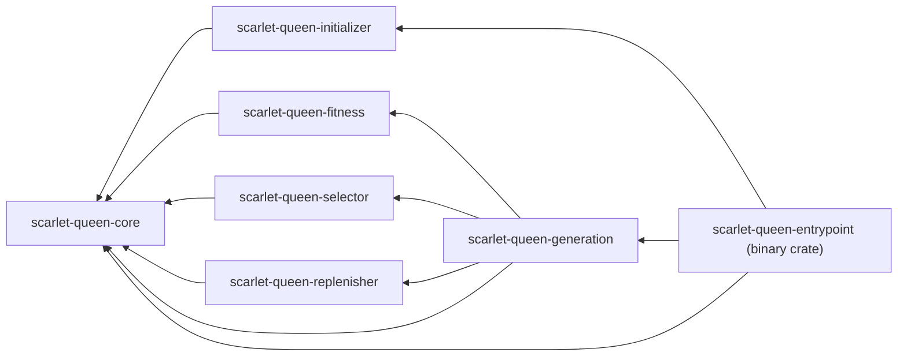
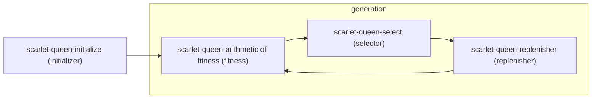
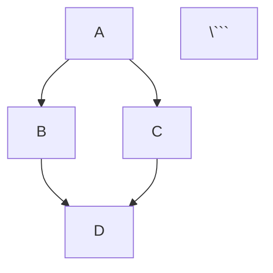
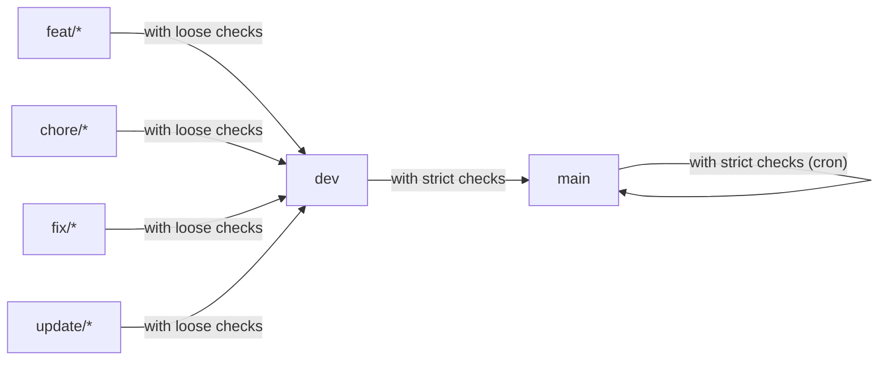

# Scarlet Queen

Scarlet Queen is a Rust framework for co-evolution.

## What mean Scarlet Queen?

The name is inspired by Red Queen's Hypothesis and Pokémon Scarlet and Violet.

Red Queen's Hypothesis is a hypothesis about co-evolution.

## Project Dependencies


```mermaid
flowchart RL
    initializer[scarlet-queen-initializer] --> core[scarlet-queen-core]
    fitness[scarlet-queen-fitness] --> core[scarlet-queen-core]
    selector[scarlet-queen-selector] --> core[scarlet-queen-core]
    replenisher[scarlet-queen-replenisher] --> core[scarlet-queen-core]
    generation[scarlet-queen-generation] --> core[scarlet-queen-core]
    entrypoint["scarlet-queen-entrypoint (binary crate)"] --> core[scarlet-queen-core]

    generation[scarlet-queen-generation] --> fitness[scarlet-queen-fitness]
    generation[scarlet-queen-generation] --> selector[scarlet-queen-selector]
    generation[scarlet-queen-generation] --> replenisher[scarlet-queen-replenisher]

    entrypoint["scarlet-queen-entrypoint (binary crate)"] --> initializer[scarlet-queen-initializer]
    entrypoint["scarlet-queen-entrypoint (binary crate)"] --> generation[scarlet-queen-generation]
```

## Life Cycle


```mermaid
flowchart LR
    initializer["scarlet-queen-initialize (initializer)"] --> fitness["scarlet-queen-arithmetic of fitness (fitness)"]
    subgraph generation
        fitness["scarlet-queen-arithmetic of fitness (fitness)"] --> selector["scarlet-queen-select (selector)"]
        selector["scarlet-queen-select (selector)"] --> replenisher["scarlet-queen-replenisher (replenisher)"]
        replenisher["scarlet-queen-replenisher (replenisher)"] --> fitness["scarlet-queen-arithmetic of fitness (fitness)"]
    end
```

## Project Structure

### `scarlet-queen-core` (library crate)

Contains the core type definition and logic.

### `scarlet-queen-initializer` (library crate)

Contains the logic for initializing the group (environment).

- modules
  - `random`: enables the random initialization.
  - `weight`: enables the weighted initialization.

### `scarlet-queen-fitness` (library crate)

Contains the fitness evaluation logic.

### `scarlet-queen-selector` (library crate)

Contains the logic for selecting individuals for the next generation.

- modules
  - `random`: enables the random selection.
  - `roulette`: enables the roulette selection.
  - `tournament`: enables the tournament selection.

### `scarlet-queen-replenisher` (library crate)

Contains the logic for replenishing new individuals.

- modules
  - `random`: enables the random generation.
  - `novelty`: enables the novelty search algorithm.

### `scarlet-queen-generation` (library crate)

Contains the logic for managing the generation process.

### `scarlet-queen-entrypoint` (binary crate)

The binary crate that runs the Scarlet Queen framework.

## Get Started

```sh
cargo run --bin scarlet-queen-entrypoint
```

## Tests

- run all tests

```sh
cargo test
```
- run tests for a specific package

```sh
cargo test -p <test_name>
```

## Docs

> [!WARNING]
> When editing docs for the first time, let it add `mdbook`

install command is under the command

```sh
cargo install mdbook
```

- watch docs

```sh
mdbook watch -o ./docs
```

- build docs

```sh
mdbook build ./docs
```

### Docs plugins

- mdbook-mermaid

You can use mermaid diagrams in this docs.

example

```md

```mermaid
graph TD;
    A-->B;
    A-->C;
    B-->D;
    C-->D;
\```
```

- mdbook-katex

You can use KaTeX for rendering math in this docs.

- inline expression

```md
$ <formula (katex expression)> $
```

- display math expression

```md
$$
<formula (katex expression)>
$$
```

## Setup Project

To format toml file and rust code, when you  commit, you need to install `husky` and `lint-staged`.

Under the commands is setup commands for `husky`, `lint-staged` and `prettier`.

```sh
npm i && npm exec husky-init -y &&  npm exec husky set .husky/pre-commit "npm exec lint-staged --allow-empty"
```

## Branch Strategy

### main

main branch is the release branch.

### dev

dev branch is the development root branch.


### feature

- feat/#[issue-number]-[issue-summary]

  example) feat/#12-add-card-button-component

### chore

- chore/#[issue-number]-[issue-summary]

  example) chore/#12-add-prettier-config

### fix

- fix/#[issue-number]-[issue-summary]

  example) fix/#12-change-title

### update

- update/#[issue-number]-[issue-summary]

  example) update/#12-update-dependencies


```mermaid
flowchart LR
    dev["dev"] -->|with strict checks| main["main"]
    feature["feat/*"] -->|with loose checks| dev["dev"]
    chore["chore/*"] -->|with loose checks| dev["dev"]
    fix["fix/*"] -->|with loose checks| dev["dev"]
    update["update/*"] -->|with loose checks| dev["dev"]
    main["main"] -->|"with strict checks (cron)"| main["main"]
```

#### with loose checks (`dev branch`)

- dev-test (`push` and `pull requests`)
- docs-test (`push` and `pull requests`)
- docs (`push`)

#### with strict checks (`main branch`)

- prod-test (`pull requests`)
- docs-test (`pull requests`)

#### with strict checks (`main branch`)

- prod-test (`cron`)
- docs-test (`cron`)
