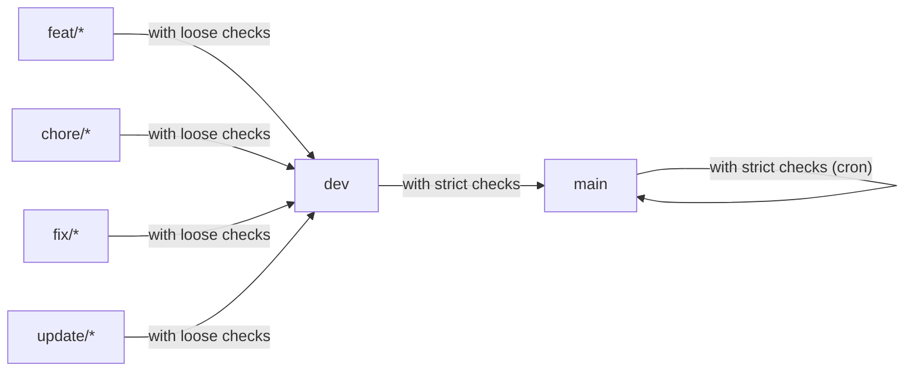

# Branch Strategy

## main

main branch is the release branch.

## dev

dev branch is the development root branch.

## feature

- feat/#[issue-number]-[issue-summary]

  example) feat/#12-add-card-button-component

## chore

- chore/#[issue-number]-[issue-summary]

  example) chore/#12-add-prettier-config

## fix

- fix/#[issue-number]-[issue-summary]

  example) fix/#12-change-title

## update

- update/#[issue-number]-[issue-summary]

  example) update/#12-update-dependencies

### with loose checks (`dev branch`)

- dev-test (`push` and `pull requests`)
- docs-test (`push` and `pull requests`)
- docs (`push`)

### with strict checks (`main branch`)

- prod-test (`pull requests`)
- docs-test (`pull requests`)

### with strict checks (`main branch`)

- prod-test (`cron`)
- docs-test (`cron`)
