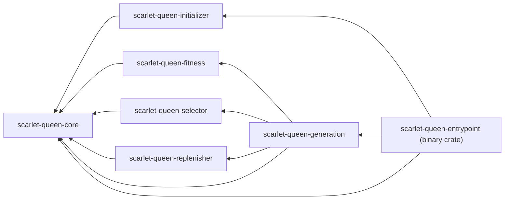
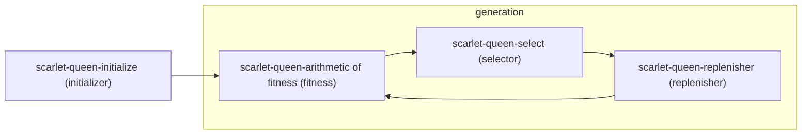

# Structure

## Project Dependencies

## Life Cycle

## Project Structure

### `scarlet-queen-core` (library crate)

https://scarlet-queen.netlify.app/doc/scarlet_queen_core/

Contains the core type definition and logic.

### `scarlet-queen-initializer` (library crate)

https://scarlet-queen.netlify.app/doc/scarlet_queen_initializer/

Contains the logic for initializing the group (environment).

- modules
  - `random`: enables the random initialization.

### `scarlet-queen-fitness` (library crate)

https://scarlet-queen.netlify.app/doc/scarlet_queen_fitness/

Contains the fitness evaluation logic.

### `scarlet-queen-selector` (library crate)

https://scarlet-queen.netlify.app/doc/scarlet_queen_selector/

Contains the logic for selecting individuals for the next generation.

- modules
  - `random`: enables the random selection.
  - `roulette`: enables the roulette selection.
  - `tournament`: enables the tournament selection.

### `scarlet-queen-replenisher` (library crate)

https://scarlet-queen.netlify.app/doc/scarlet_queen_replenisher/

Contains the logic for replenishing new individuals.

- modules
  - `random`: enables the random generation.
  - `roulette`: enables the roulette selection.
  - `tournament`: enables the tournament generation.

### `scarlet-queen-generation` (library crate)

https://scarlet-queen.netlify.app/doc/scarlet_queen_generation/

Contains the logic for managing the generation process.

### `scarlet-queen-entrypoint` (binary crate)

https://scarlet-queen.netlify.app/doc/scarlet_queen_entrypoint/

The binary crate that runs the Scarlet Queen framework.
